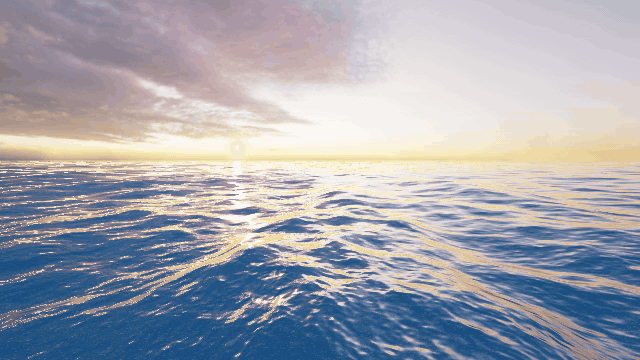
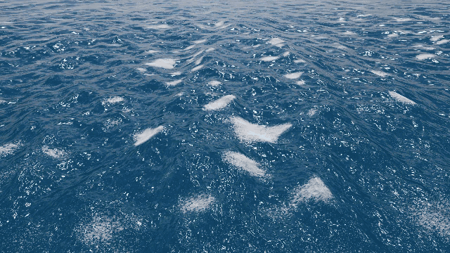
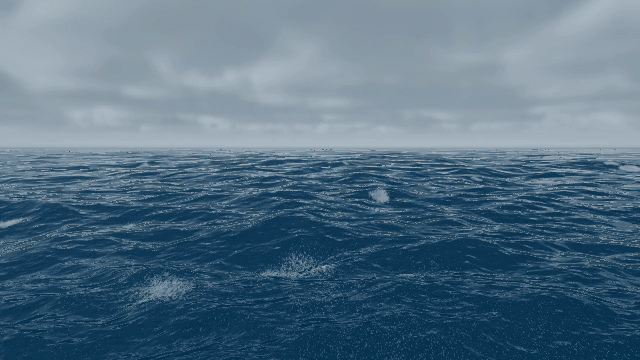
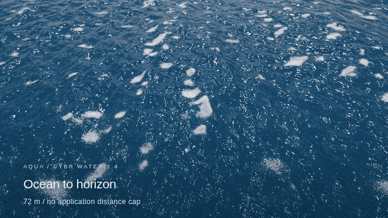

# AQUA — Three.js Open

**GPU spectral oceans, persistent whitewater, geometry-aware water optics, and unrestricted camera dolly.**

The editable **CYBR WATER 2.4** project, including the local runtime assets, offline build, numerical checks, and reproducible camera/capture tools. No runtime CDN or API key is required.



## Water in motion

<table>
<tr>
<td width="50%"><br><strong>Persistent whitewater</strong><br>Compression-driven formation, transport, aging, and porous coverage.</td>
<td width="50%"><br><strong>Crossing seas</strong><br>Directional swells and shorter wind waves, with secondary spray.</td>
</tr>
</table>



**Free-distance camera:** wheel, pinch, buttons, and keyboard dolly without an application upper-distance clamp. Camera clipping and visible ocean coverage scale with the view. The model remains a periodic planar ocean, not a planet-scale fluid domain.

The GIFs are reduced-resolution, offline captures of **this repository's renderer**, using the same scene/camera definitions as the 2.4 film. They are not generated imagery, and their playback rate is not a live-performance benchmark. The capture script and per-preview provenance are in [`tools/readme_gifs.py`](tools/readme_gifs.py) and [`docs/media/manifest.json`](docs/media/manifest.json).

## Run locally

The browser-ready files and assets are committed. With Python 3 installed:

```sh
git clone https://github.com/cybrdelic/aqua-threejs-open.git
cd aqua-threejs-open
python3 -m http.server 8000 --directory public
```

Open **http://localhost:8000/**. No npm installation or bundler is needed to run the committed build. The page requires WebGL2 and the floating-point rendering capabilities used by the simulation; a clear error is shown when initialization fails.

For a completely self-contained HTML file:

```sh
python3 tools/build.py
```

Open `public/standalone.html`. It embeds the renderer, materials, and environment maps; its compressed assets require browser `DecompressionStream` support. The generated standalone is intentionally not tracked in Git.

After editing `source/`, run the same build command to update `public/engine-bundle.js` and the standalone file. The committed bundle lets a fresh clone run immediately.

## Implemented systems

| System | Implementation |
| --- | --- |
| Wave field | Three GPU FFT wavelength bands; independently normalized dominant swell, crossing swell, and wind sea; finite-depth dispersion and spectral derivatives. |
| Whitewater | Periodic persistent density/age/aeration fields; combined-crest compression; filtered porous shading; secondary spray and bubbles. |
| Water optics | Fresnel reflection/refraction, RGB extinction, geometry tracing, refracted seafloor caustics, underwater views, and temporal reconstruction. |
| Local interactions | Depth-averaged perturbations, ripple impulses, boat wakes, rain contacts, and constrained fluid/body interaction models. |
| Camera | Cinematic, orbit, overhead, and underwater views; wheel/pinch dolly; adaptive clipping and coverage; home-view reset. |
| Replay | Fixed-tick simulation inputs and seeded same-build/backend reproducibility. Not a completed multiplayer networking layer. |
| Diagnostics | Normal, compression, optical-depth, and other implementation inspection views; reference numerical and browser checks. |

The default desktop/high-quality ocean uses three **256 × 256** spectral grids; the mobile/low-quality path uses **128 × 128** grids. The detailed implementation notes are in [`docs/CYBR-WATER-2.4-README.md`](docs/CYBR-WATER-2.4-README.md).

## Controls

| Input | Action |
| --- | --- |
| Drag | Orbit the camera. |
| Wheel / two-finger pinch | Dolly in and out. |
| `−` / `+` or panel zoom buttons | Dolly without the old maximum-distance clamp. |
| `Home` / **Home view** | Restore the cinematic view. |
| `H` | Hide or show controls. |
| `N` | Cycle diagnostic shading. |
| `Space` | Pause or resume. |
| Scene panel | Select scenes, camera modes, whitewater/optics options, impulses, extinction, recording, and replay export. |

## Build and verify

Python 3 and Node.js are used by the development tools. NumPy is needed for the independent wave audit:

```sh
python3 -m pip install -r requirements.txt
python3 tools/build.py
node tools/spectrum_audit.cjs
python3 tools/wave_audit.py
node tools/tests.cjs
```

The original release contains **35 implementation/regression checks** and a sampled composed-wave audit over **1.6 million points**. Regenerate the audit before relying on it after spectrum changes. Historical release records are preserved under `docs/` and `capture/output/`; they are not a claim that a modified checkout has been tested.

For browser/GPU and touch-input checks on the Linux reference environment:

```sh
python3 -m playwright install --with-deps chromium
xvfb-run -a python3 tools/browser_checks.py
```

See [`docs/RELEASE-VALIDATION.md`](docs/RELEASE-VALIDATION.md), [`docs/IMPORT.md`](docs/IMPORT.md), and the [CI runs](https://github.com/cybrdelic/aqua-threejs-open/actions) for scope and current results.

## Reproduce previews and cinematic video

The GIF capture needs FFmpeg, Chromium/Playwright, Pillow, and a working WebGL2 context. The original capture scripts additionally produce the full native-1080p, five-shot, **42-second** film.

```sh
python3 -m pip install -r requirements.txt -r requirements-preview.txt
python3 -m playwright install --with-deps chromium
python3 tools/build.py

# README previews, generated from the live renderer.
xvfb-run -a python3 tools/readme_gifs.py
python3 tools/check_repo.py

# Original film: newly rendered frames, fixed 60 Hz physics, 24 fps output.
xvfb-run -a -s '-screen 0 1920x1080x24' python3 capture/render.py
python3 capture/assemble.py
```

Set `CHROMIUM_EXECUTABLE` to use a specific Chromium executable. FFmpeg and Xvfb are system packages and are not installed by pip. Browser tests/captures in the supplied release used Linux Chromium and a software GPU, not a physical Android handset.

## Repository layout

```text
source/          Editable simulation, renderer, shaders, UI, and module order
public/          Ready-to-serve local runtime, bundled Three.js, textures, HDR maps
tools/           Build, numerical audit, browser checks, GIF capture, repository checks
capture/         Native-resolution cinematic capture and assembly
capture/output/  Original capture provenance (not the large MP4 outputs)
docs/            Validation records, import provenance, and animated README media
licenses/        Retained license notice for the imported CYBR WATER source
```

## Model boundaries

This is a **spectral ocean surface plus a local depth-averaged interaction field**. It is not a volumetric FLIP/APIC solver and does not resolve overturning breakers, liquid sheets, two-phase air entrainment, or general three-dimensional fluid–solid coupling. Whitewater, spray, bubbles, and several optical terms are approximations. Extending the camera range does not create more unique simulated water.

Read [`LIMITATIONS.md`](LIMITATIONS.md) before treating visuals, replay, or tests as evidence of experimental physical accuracy, cross-GPU determinism, or a particular real-time frame rate.

## License and assets

The repository's existing **GNU GPL version 2** text is retained unchanged in [`LICENSE`](LICENSE). The imported CYBR WATER distribution's MIT copyright/license notice is retained separately in [`licenses/CYBR-WATER-MIT.txt`](licenses/CYBR-WATER-MIT.txt). Three.js retains its own [MIT notice](THREE-LICENSE.txt). The photographic environment and surface assets retain their CC0 attribution in [`ATTRIBUTION.md`](ATTRIBUTION.md).
